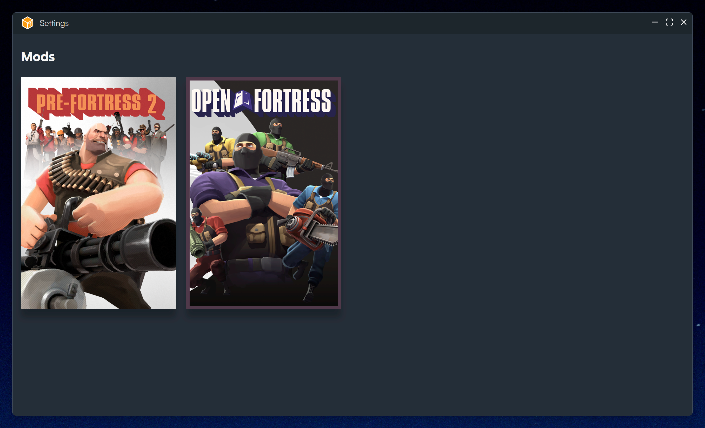
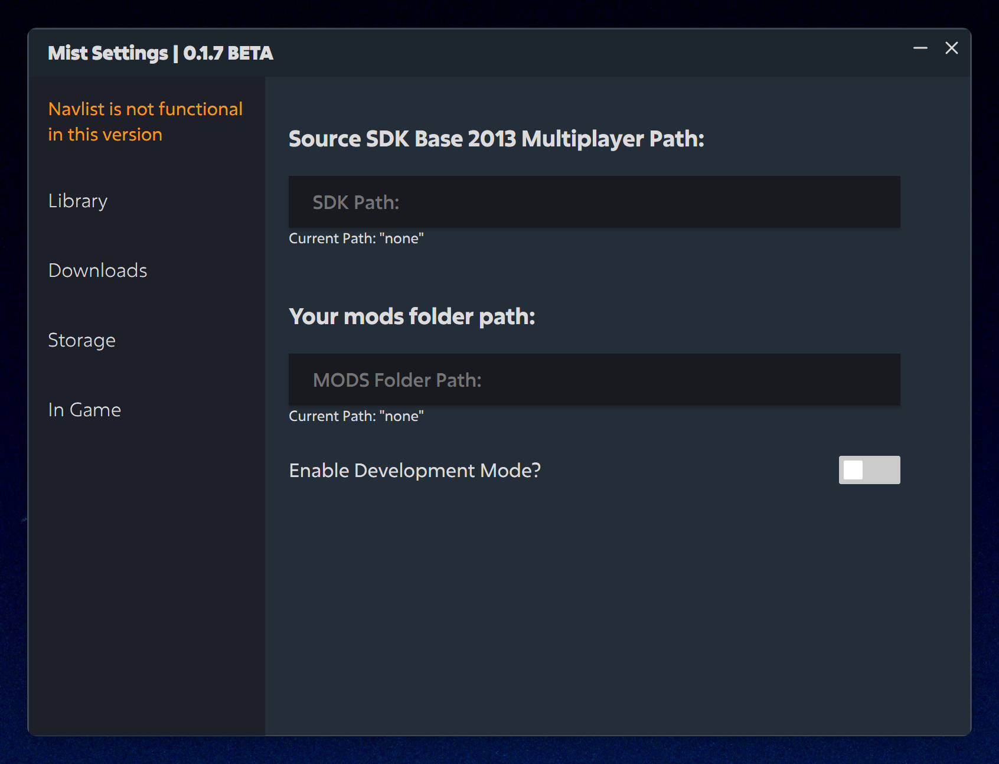

# Mist getting started
<html
  <iframe src="https://status.mist.tf/badge?theme=dark" width="250" height="30" frameborder="0" scrolling="no"></iframe>

Welcome to **Mist**!

Here we will guide you to setup **Mist** for installing mods:

#### Before you install any mods please follow the steps below:

## Step 1:

Go to settings:

When you pressed settings, this should popup:

You need to input the path for "Source SDK Base 2013 Multiplayer" and then input the path for "MODS Folder path:" this path tells where mist can save the download file and where to extract each mod. This is necessary for downloading and installing or importing mods.

## Step 2:

When you have finished doing your settings. Then you can download and install or import exsisting mods.

## Known Issues:

If your settings don't get saved. Please check that `mist-tf` folder exsist in `C:/users/{you}/AppData/Roaming/`
